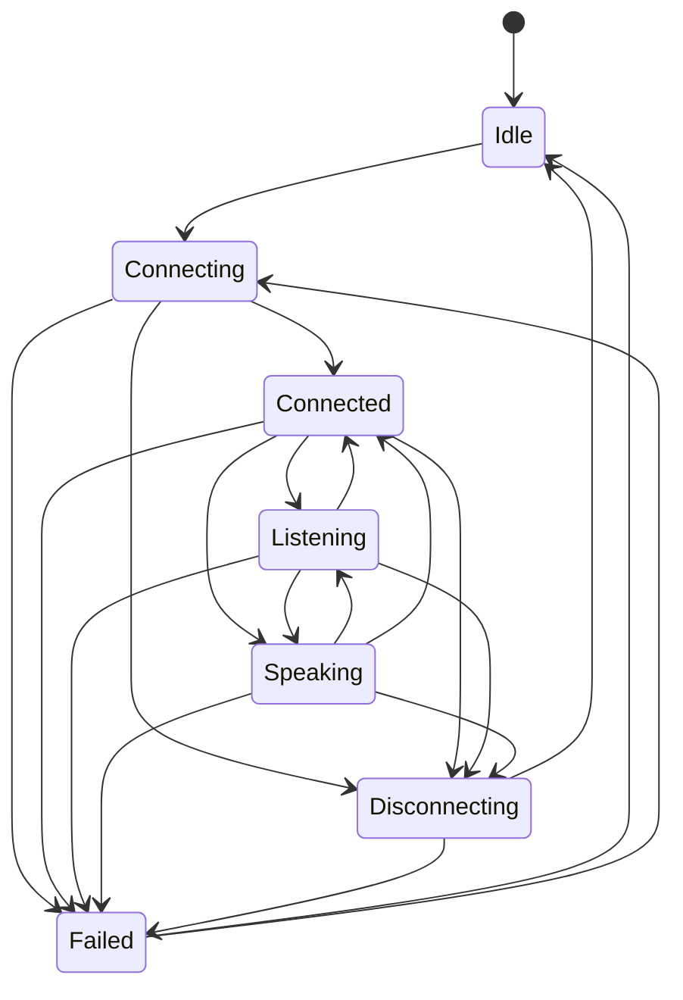

## Session State Machine (Chapter 2)

**Design notes**
- `kotlinx-coroutines-core` is exposed as `api` because `StateFlow`/`SharedFlow` are part of the public contract.
- Events use a hot `SharedFlow` without replay: events emitted with no collector are dropped (covered by tests).
- `fail()` and `reset()` intentionally bypass the transition table.
- Status: Chapter 2 delivers the core contract and state machine only. No networking or audio yet.